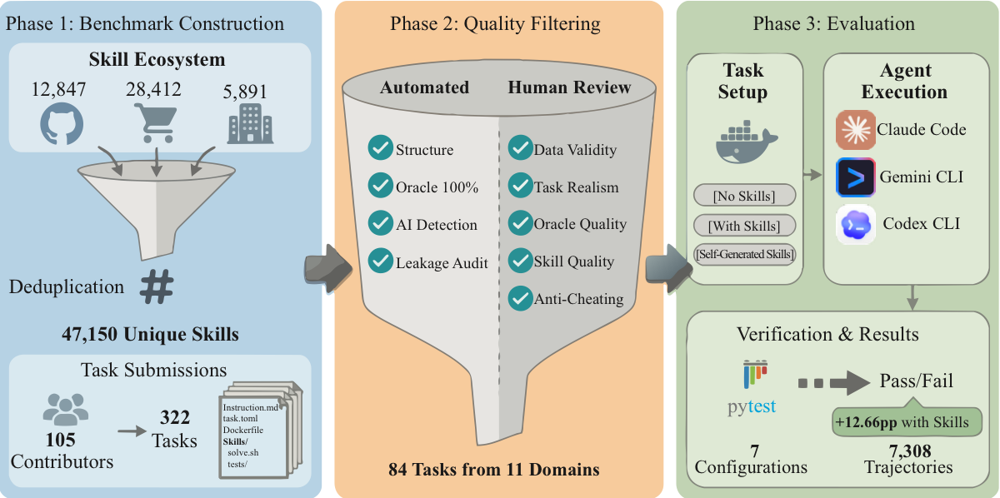
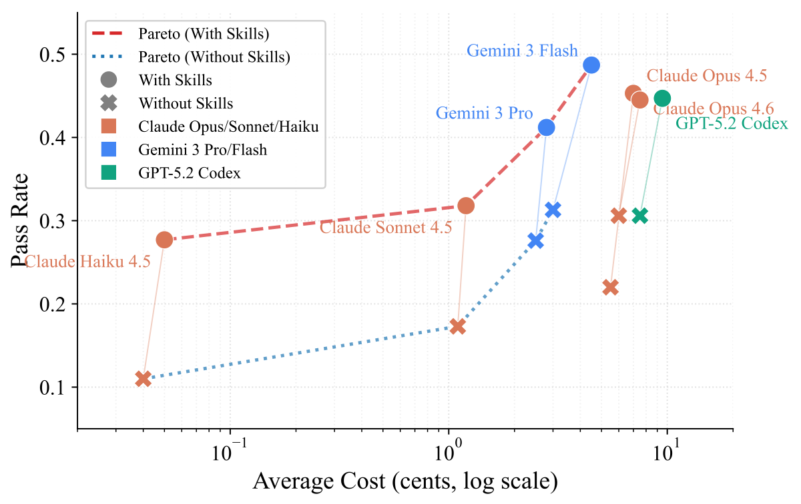
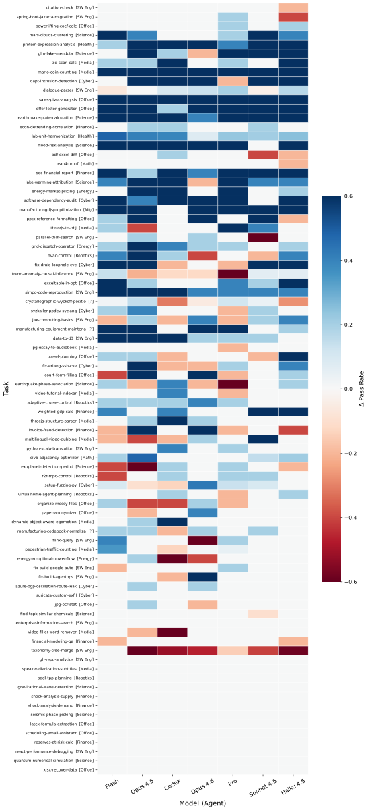

# SkillsBench 阅读笔记（重写版 v2）

## 0) Metadata
- **Title:** Benchmarking How Well Agent Skills Work Across Diverse Tasks
- **Alias:** SkillsBench
- **Venue / Status:** arXiv 2602.12670 (v3)
- **Links:**
  - Abs: https://arxiv.org/abs/2602.12670
  - PDF: https://arxiv.org/pdf/2602.12670
- **My rating:** ★★★★☆
- **Read depth:** deep
- **Scoring (1+2+2):** 基础 1 + 质量 1 + Observation 2 = 4

---

## 1) 一句话：为什么值得读（key claim + key observation）
**这篇值得读，因为它把“skills 是否有效”变成了可验证的大规模实证问题（而不是经验争论）；最关键 observation 是：curated skills 平均 +16.2pp，但 self-generated skills 平均无收益（约 -1.3pp）。**

---

## 2) CRGP 拆解 Introduction

### C — Context
- LLM agent 已从“文本生成”转向“多步任务执行”（CLI/工具调用/环境交互）。
- 基础模型有通用能力，但缺 domain-specific procedural knowledge。
- skill（指令+模板+资源+验证逻辑）成为推理期增强手段，生态增长很快。

### R — Related Work
- 现有 benchmark 主要评估裸模型/裸 agent 在任务上的性能。
- 缺少“同任务下，有无 skill 的增量评估”框架。

### G — Gap
- 缺少把 skills 当作一等评测对象的标准 benchmark。
- 缺少对“何时有用、何时有害、为什么”的系统证据。

### P — Proposal
- 提出 SkillsBench：84 个评测任务（跨 11 域）、deterministic verifier、全轨迹日志。
- 三条件评测：no-skills / curated skills / self-generated skills。
- 在 7 个 model-harness 配置上做 7308 条有效轨迹的大规模实验。

---

## 3) 图解（论文插图）

### 图1：评测流程总览（pipeline）

### 图2：性能-成本 Pareto

### 图3：skills uplift 热力图

> 注：图片来自论文源码 figs（从 arXiv source 导出并本地化）。

---

## 4) 实验：设定、主结果表、分析性实验

## 4.1 实验设定（Experimental Setup）
- **任务**：84 tasks，11 domains。
- **模型/Agent 组合（7 个）**：
  - Claude Code × {Opus 4.5, Opus 4.6, Sonnet 4.5, Haiku 4.5}
  - Gemini CLI × {Gemini 3 Pro, Gemini 3 Flash}
  - Codex CLI × {GPT-5.2}
- **条件**：
  1) No Skills
  2) Curated Skills
  3) Self-Generated Skills（Gemini CLI 不支持）
- **规模**：7308 条有效 trajectory。
- **指标**：Pass Rate + Normalized Gain（论文 Eq.1）。

---

## 4.2 主结果表（含关键数字）

> 下表是论文主表核心字段的“读者版摘要表”（保留你最关心的比较数字）。

| Harness | Model | No Skills | Curated Skills | Δ (pp) | Self-Generated | Δ_self (pp) |
|---|---:|---:|---:|---:|---:|---:|
| Gemini CLI | Gemini 3 Flash | 31.3 | **48.7** | +17.4 | — | — |
| Claude Code | Opus 4.5 | 22.0 | 45.3 | **+23.3** | 21.6 | -0.4 |
| Codex CLI | GPT-5.2 | 30.6 | 44.7 | +14.1 | 25.0 | **-5.6** |
| Claude Code | Opus 4.6 | 30.6 | 44.5 | +13.9 | 32.0 | +1.4 |
| Gemini CLI | Gemini 3 Pro | 27.6 | 41.2 | +13.6 | — | — |
| Claude Code | Sonnet 4.5 | 17.3 | 31.8 | +14.5 | 15.2 | -2.1 |
| Claude Code | Haiku 4.5 | 11.0 | 27.7 | +16.7 | 11.0 | 0.0 |
| **Mean** |  | **24.3** | **40.6** | **+16.2** | **21.0** | **-1.3** |

### 主结果解读
- Curated skills 带来显著增益（平均 +16.2pp）。
- Self-generated 平均无增益（-1.3pp），且在 Codex 上明显退化（-5.6pp）。
- “最好最终性能”与“最大提升”不是同一个配置（Flash 最终最好；Opus4.5 提升最大）。

---

## 4.3 分析性实验（按“现象 + 解释”写）

### A) Domain 差异
**现象**：增益跨域差异很大。
- Healthcare: +51.9pp
- Manufacturing: +41.9pp
- Software Engineering: +4.5pp
- Mathematics: +6.0pp

**解释（作者）**：预训练覆盖低、流程知识更专业的领域更依赖 skills。  
**【标注-我的看法】**：还可能有“verifier 形态差异”影响——一些领域任务更容易被流程化技能稳定命中，而另一些领域（如泛化编程）受开放解空间影响更大。

---

### B) 任务级负增益
**现象**：16/84 任务出现负增益（有 skills 反而更差）。

**解释（作者）**：skills 可能引入冲突指导或额外复杂度。  
**【标注-我的看法】**：另一个常见机制是“注意力预算挤占”：当 skills 文档较长且检索不准时，会把模型的上下文容量浪费在低相关步骤上，导致决策路径被扰动。

---

### C) Skills 数量效应
**现象**：2~3 个 skills 最优（+18.6pp）；4+ skills 仅 +5.9pp。

**解释（作者）**：信息过载与冲突指导导致边际收益下降。  
**【标注-我的看法】**：这很像检索系统里的“召回-精度权衡”：过多 skills 提高召回但显著拉低 precision，最终变成行动噪声。

---

### D) Skills 复杂度效应
**现象**：detailed/compact 有效；comprehensive 可能负增益（论文表中约 -2.9pp）。

**解释（作者）**：过长文档让 agent 难以提炼 actionable 信息。  
**【标注-我的看法】**：comprehensive 文档常包含“背景知识+例外分支+不常用流程”，对单任务决策来说像引入多个竞争 policy，会降低执行稳定性。

---

### E) 模型规模补偿效应
**现象**：小模型 + skills 可超过大模型无 skills（如 Haiku with skills > Opus no-skills）。

**解释（作者）**：skills 能部分补偿模型容量不足。  
（这里我认同作者叙事，暂不加个人标注。）

---

## 5) 评分解释 + 对我们研究的价值

## 5.1 为什么是 4 星（不是 5 星）
- **基础 1**：默认。
- **质量 1/2**：
  - 优点：规模化、协议清晰、可复验，且有多维分析。
  - 扣分：核心是 benchmark/measurement 贡献，方法机制创新有限；对“负增益因果机制”的实验拆解还不够深。
- **Observation 2/2**：
  - 给出多个高价值 observation（self-gen 失效、2-3 最优、comprehensive 可能有害、小模型补偿效应）。

=> **总分 4/5 合理。**

---

## 5.2 对我们研究有什么用（直接可落地）
1. **建立技能质量门禁（quality gate）**
   - 新 skill 必须过 no-skill vs curated vs self-gen 三条件 A/B 才能入库。
2. **默认采用“少量高精技能”策略**
   - 先 2~3 个高相关 skill，而不是大而全技能包。
3. **显式记录负增益任务**
   - 这些任务是最有价值的诊断样本，优先修复检索与技能冲突。
4. **把成本也纳入评估**
   - 结合 Pareto（性能-成本）而非只看 pass rate。

---

## 6) Why not higher score
- 这篇非常有用，但更像“评测范式基建”而非“机制新算法突破”；若后续在负迁移机制上给出更强因果实验，可接近 5 星。
